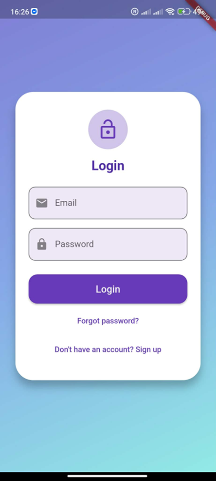
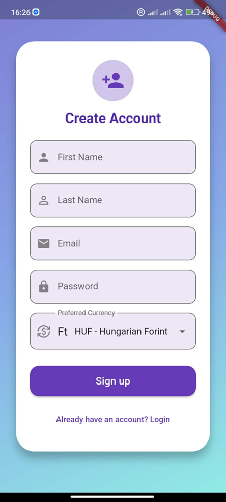
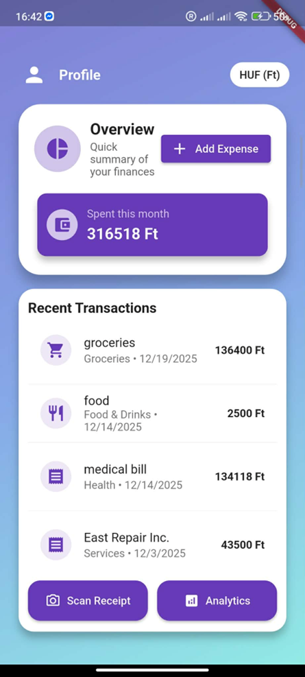
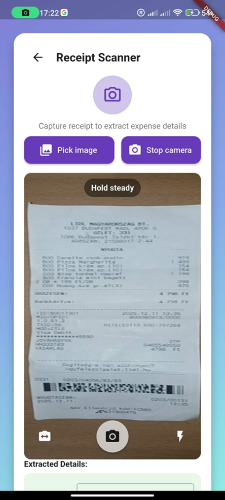
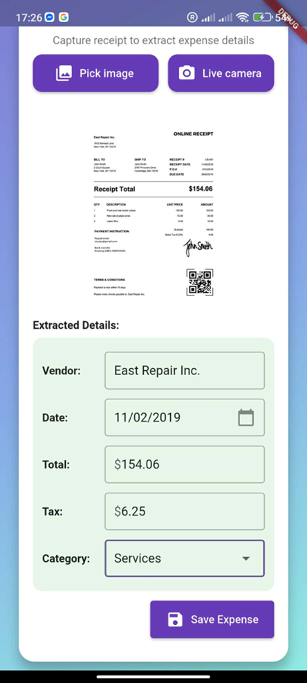
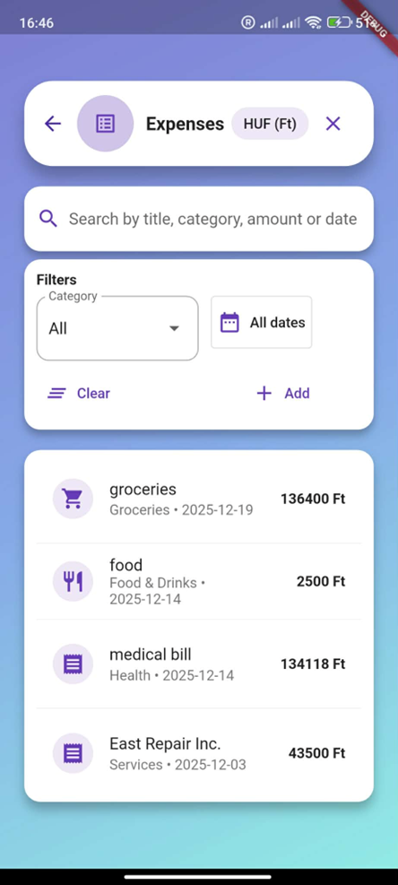
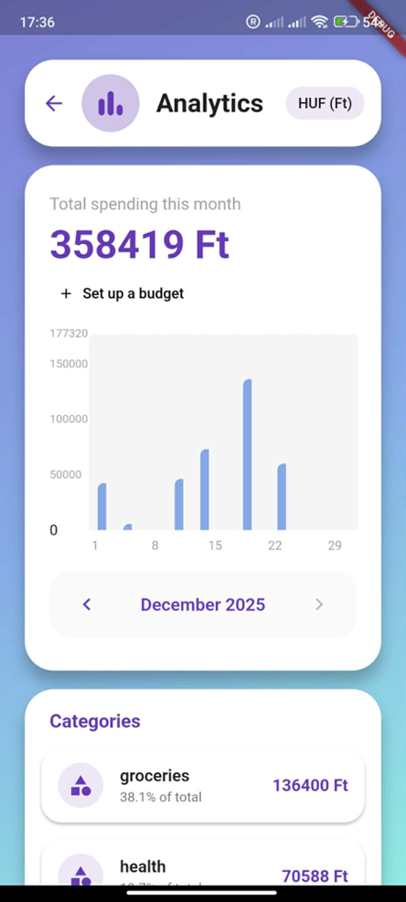
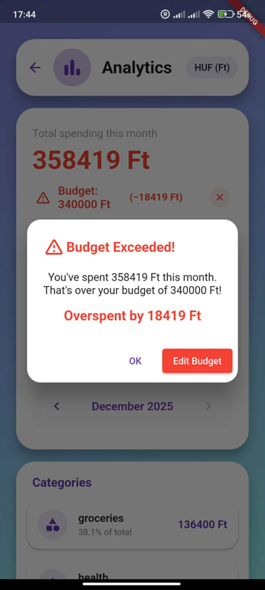
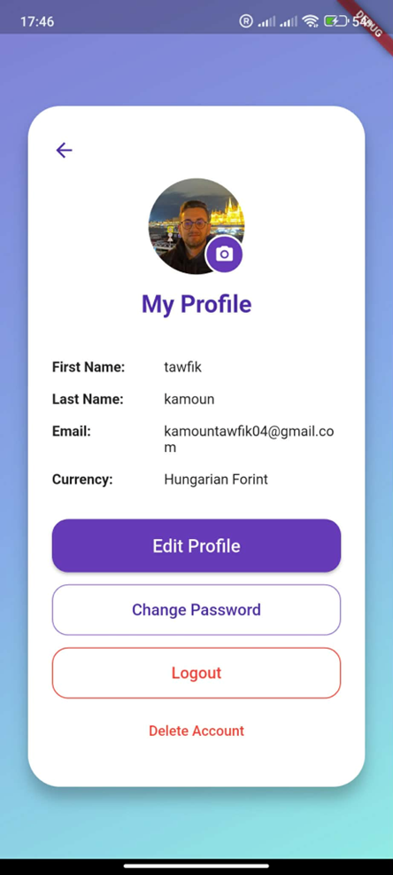

💸 Smart Expense Tracker
A fully-featured Flutter mobile application for personal finance management. Scan receipts with your camera, track expenses, analyze spending patterns, and manage budgets — all 100% on-device, no cloud required.

| Login | Register | Dashboard |
|---|---|---|
|  |  |  |

| Receipt Scanner | OCR Result | Expense List |
|---|---|---|
|  |  |  |

| Analytics | Budget Alert | Profile |
|---|---|---|
|  |  |  |

✨ Features

🔐 Authentication & Profile

Email/password registration and login
Forgot password and reset password flow
Profile management with avatar photo
Multi-currency support (HUF, EUR, USD) with automatic conversion display

📷 Receipt Scanner (OCR)

Live camera capture with real-time viewfinder and "Hold steady" guidance
Gallery image picker for existing receipt photos
On-device text recognition via Google ML Kit — no internet required
Automatic extraction of: Vendor name, Date, Total amount, Tax
Pre-filled expense form from extracted data for quick confirmation

💰 Expense Management

Manual expense entry with title, amount, category, and date
Edit and update existing transactions
Category tagging (Groceries, Food & Drinks, Health, Services, etc.)
Full CRUD operations on all expenses

🔍 Expense List & Search

Scrollable list of all transactions
Real-time search by title, category, amount, or date
Filter by category (dropdown)
Date range filtering: Today, Last 7 days, This month, Custom range

📊 Analytics Dashboard

Monthly total spending overview
Daily spending bar chart with month navigation
Category breakdown with percentage of total
Budget setup and tracking
Budget exceeded alerts with overspend amount highlighted

🛠️ Tech Stack
LayerTechnologyFrameworkFlutter 3.7+ (Dart)State ManagementProviderLocal DatabaseHive + Hive FlutterOn-Device OCRGoogle ML Kit Text RecognitionCameraFlutter CameraImage Pickerimage_pickerChartsfl_chartAuth (local)crypto (SHA hashing)InternationalizationintlPermissionspermission_handler

📂 Project Structure
lib/
├── main.dart
├── core/
│   ├── constants/
│   │   └── currencies.dart          # Supported currencies (HUF, EUR, USD)
│   ├── providers/
│   │   └── currency_provider.dart   # Global currency state
│   ├── utils/
│   │   ├── currency_utils.dart      # Currency formatting helpers
│   │   └── image_processor.dart     # Image pre-processing for OCR
│   └── widgets/
│       └── price_display.dart       # Reusable currency-aware price widget
└── features/
    ├── analytics/presentation/screens/
    │   └── analytics_screen.dart    # Charts, budget tracking, category breakdown
    ├── auth/presentation/screens/
    │   ├── login_screen.dart
    │   ├── register_screen.dart
    │   ├── forgot_password_screen.dart
    │   └── profile_screen.dart
    ├── expenses/presentation/screens/
    │   ├── add_expense_screen.dart
    │   ├── capture_screen.dart      # Receipt camera/gallery capture
    │   └── expense_list_screen.dart
    ├── home/presentation/screens/
    │   └── dashboard_screen.dart
    └── ocr/presentation/screens/
        └── ocr_screen.dart          # ML Kit OCR processing & data extraction

🚀 Getting Started
Prerequisites

Flutter SDK >=3.7.2
Dart SDK
Android Studio or VS Code with Flutter & Dart extensions
Physical Android/iOS device or emulator with camera support

Installation
bash# Clone the repository
git clone https://github.com/kamoun-tawfik/smart-expense-tracker.git

# Navigate into the project
cd smart-expense-tracker

# Install dependencies
flutter pub get

# Run the app
flutter run
Android Permissions
The following permissions are required and handled automatically by permission_handler:

CAMERA — for live receipt scanning
READ_EXTERNAL_STORAGE / READ_MEDIA_IMAGES — for gallery image picker

🔍 How the OCR Pipeline Works
Camera / Gallery
      ↓
Image Pre-processing (orientation correction via EXIF)
      ↓
Google ML Kit Text Recognition (on-device, offline)
      ↓
Custom Text Parser
      ↓
Extracted: Vendor · Date · Total · Tax
      ↓
Pre-filled Expense Form → Saved to Hive

User opens the Receipt Scanner and captures or picks a receipt image
The image is pre-processed to correct orientation using EXIF data
Google ML Kit processes the image entirely on-device
A custom parser scans the recognized text for vendor name, date patterns, total and tax amounts
Extracted fields are pre-populated in the Add Expense form for user review
Confirmed expenses are stored locally in Hive with password hashing via crypto

🔒 Privacy & Security

All data is stored locally on-device using Hive
Passwords are hashed using the crypto package before storage
No data is ever sent to external servers
No analytics, tracking, or ads

🎓 About
Built as a university project at the Budapest University of Technology and Economics (BME) as part of the MSc Computer Engineering — Software Engineering specialization program.

👤 Author
Tawfik Kamoun
MSc Software Engineering @ BME Budapest
